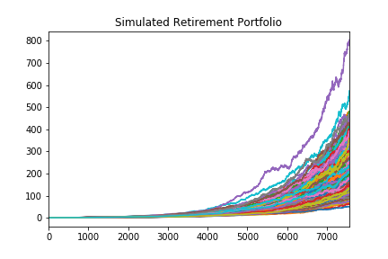

# Financial Report
# API

## Overview
The purpose of this financial report is to summarize the findings of the work performed for Harol'ds investment company to obtain data through APIs and simulating retirement investment projections. 

### 1. **Budget Analysis:** 
The Plaid API was used to obtain transaction- and account- data for 90 days to perform the budget analysis. Below a summary of the findings related to spending.
* **Total spending per category:**  
The 2 largest spending categories were Transfers and Payment which consitutes 88.2% of the total spending. More detailed information is required to understand what these transfers and payments relate to and how this is further allocated to various expense categories. 
Travel expense is low, but one can expect spikes in travel cost during certain months of the year.

  
   
* **Expenses per month:** 
Monthly expenses are consistent at `$10645.24` from April to June, with a -`$4.22` amount allocated to July. This is due to the fact that data was extracted on 9th of July, thus July should be ignored for comparison. More data is required to understand why the monthly expenses do not change.
  
  

### 2. **Retirement Planning:** 
The retirement planning analysis was performed by using Alpaca API to get historical closing prices for the retirement portfolio and then using it to run a Monte Carlo simulation to project the performance of the portfolio in 30 years. The portfolio consists of 40% Bonds (AGG) and 60% SPDR S&P 500 stocks (SPY).

For the Monte Carlo simulation 500 simulations were performed for 252 x 30 days. 

Below is a plot that shows the outcome of the simulation of cumulative returns of the portfolio. 

The cumulative returns were further analyzed and a histogram plotted with a 90% confidence interval of the cumulative returns at the end of the projected period.   

  There is a 90% confidence that the range of the cumulative returns will fall between `$102.83` and `$379.34` by the end of 30 years. 

For an initial investment of `$20,000`:
* the cumulative returns at 30 years will be the following :
| Percentile  | Return | 
| --- | --- |
| 10th percentile | 2,380,597|
| 50th percentile | 3,981,799|
| 90th percentile | 6,410,996|

To determine whether current projected annual income would meet or exceed projected retirement income, a 4% rate was applied to the cumulative returns at the 10 percentile. 

The 4% withdrawal at the 10th percentile is `$95,223`, which is more than the Plain projected income of `$7,389`, so there should be sufficient funds at retirement.

If the initial investment is increased with `50%`, the `4%` withdrawal at the 10th percentile increases to `$142,835`. This is much more than the current projected annual income.

#### Cumulative returns at 5%, 50% and 95% quartiles:
* The below line chart is a view of the cumulative returns over the life of the investment for the 3 different quartiles:   

### 3. **Retirement plan options:**
**Increased portfolio risk - 30 years simulation**  
To increase the risk of the portfolio, the portfolio weights of the Monte Carlo simulation was adjusted by increasing stocks allocated to the portfolio and decreasing bonds: thus 25% AGG and 75% SPY.

The outcome was as follows:
 
* For an initial investment of $20000, cumulative returns at the end of the 30 year period for the 10th, 50th, and 90th percentiles: 
| Percentile  | Return | 
| --- | --- |
| 10th percentile | 4,790,488|
| 50th percentile | 9,643,547|
| 90th percentile | 18,554,503|

The return is much higher than the initial simulation performed where the portfolio weight allocation was 40% AGG and 60% SPY. 

The outcome of the `90%` confidence interval at 30 years is between 206.85 and 1,078.18. This does not take into account all aspects including volatility of the stock.

**Increased portfolio risk with retirement in 5 years** 
 To determine if the retirement is possible in 5 years, the high-risk portfolio simulation (above) was adjusted to run for a 5 year period only.  

* For an inital investment of 20,000, cumulative returns at the end of the 5 year period for the 10th, 50th, and 90th percentiles are as follows: 
| Percentile  | Return | 
| --- | --- |
| 10th percentile | 44,115|
| 50th percentile | 56,937|
| 90th percentile | 73,078|

When calculating the 4% withdrawal amount at the 10th percentile, the result of 1,764 is much less than projected income of 7,389. This is an indication that there is too little investment and growth to retire in 5 years.

If the investment amount is increased to 100,000:
* The cumulative returns at the end of the 5 year period for the 10th, 50th, and 90th percentiles are as follows: 
| Percentile  | Return | 
| --- | --- |
| 10th percentile | 220,574|
| 50th percentile | 284,686|
| 90th percentile | 365,393|

With an increased investment of 100,000 on the high-risk 5 year simulation, the expected cumulative returns does increase drastically as indicated above. 

The 4% withdrawal at the 10th percentile is 8,822, which is more than projected income of 7,389 , so it would be possible to retire at 5 years with an initial investment of 100000. 

### 3. **Recommendation:**
Considering the above simulations, in theory one should be able to invest 100,000 and retire in 5 years when investing in a high-risk portfolio.

However, life expectancy of a person does impact the outcome of the 4% withdrawal rule and plays a major role in determining if this would be sustainable - if you live longer, you will need more funds. Secondly, the 4% withdrawal rule does not take into account major economic downturns, which will negatively impact the value of the investment.

Investing in a portfolio with increased risk, on face-value looks more lucrative, but the risk associated is much more and volatility not taken into account.

With increased risk, it is better to invest long-term to benefit from the gains and to allow time to recover from volatility. However, the returns on a portfolio with less risk, is a more conservative approach.

High risk investment for short periods, e.g. 5 years, is not recommended due to the possible future volatility of the market that is not taken into account in the simulation.

Lastly, it is important to note that the Monte Carlo simulation looks at historic data and it has its limitations which include that it cannot account for bear markets, recessions, or any other kind of financial crisis that might impact potential results.

Investment in a balanced portfolio of stocks and bonds is still the best recommended option.
